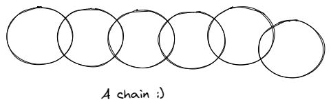
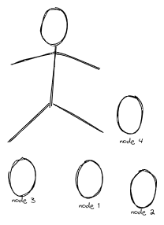
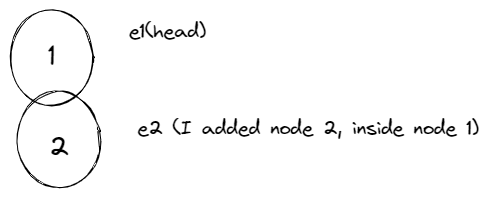

# Python 创建链表

## 什么是链表

链表是一种以链的形式来存储数据的数据结构。链表的结构是这样的：每一个数据都与其后一个数据相连（有时候也与前一个数据相连）。链表中的每个元素都被称为一个结点。

你可以把它看作一个实际的链条，其中每一环或者结点都是相连的。

就像这样：

就像其他所有的数据结构一样，链表也有它的优点和缺点。

### 链表的优点

1. 因为链表是一个链式的数据结构，你可以快速地添加和移除其中的元素。并且这也不需要像数组或者列表那样来重新组织数据。线性的数据结构用链表来实现更加容易。

2. 同样因为它的链式结构，链表也不需要一个固定的或者初始的大小。

### 链表的缺点

1. 与数组相比，链表占用更多的内存空间。这是因为你需要一个占用额外内存空间的指针来指向下一个元素。

2. 在链表上执行搜索操作非常的慢。不像数组，你不能随机访问链表中的元素。

## 什么时候应该用链表呢？

1. 你不知道数据列表中会有多少个元素（这是链表的一个优势 - 添加元素非常简单）。

2. 你不需要随机访问任何一个元素（与数组不同，你不能在链表中以一个特定的索引访问元素）。

3. 你想要在数据列表的中间插入元素。

4. 你需要以常数式时间从数据列表中插入和删除元素（与数组不同，你不需要先移动数据列表中的每一个其他元素）。

---

## 如何在Python中使用链表

这里有一个创建链表的技巧——它帮助我更好地理解链表。

你只需要意识到你将要添加到链表中的每一个元素都只是一个结点（就像链条中的一环）。头结点（链表中的第一个结点）的特殊之处在于你先确定一个头结点，然后再开始向它后面添加其他结点。

请记住一个链表就像一个链条是怎么连接在一起的。

这里是Joe和一些环，他会帮助我们去学习链表。

在接下来的内容，我会用这张图片去阐述一些事情。所以你可以将图片和文字联系起来思考（这不是艺术课 —— 我重复，这不是艺术课 :) ）。

创建节点：

[source,python]
----
class Node:    
	def __init__(self,value):        
		self.value = value        
		self.next = None
----

就是这样。我们需要value这个成员是因为对于任何添加到链表中的元素，它或多或少有一个值（例如，除了极少情况外，你不会向数组中添加一个空字符串，对吗？）

next这个成员使得我们可以与其他结点连接在一起 —— 我的意思是，这就是链表的主要目标。

接下来我们要去定义一些基本的函数。
[source,python]
----
class LinkedList:
    def __init__(self,head=None):
	    self.head = head    
	def append(self, new_node):
            current = self.head
            if current:
                while current.next:
                    current = current.next
                current.next = new_node
            else:
                self.head = new_node
----

append()函数能让你添加结点到链表上。让我们来探索它是怎么工作的。

如果我有两个值 - 例如1和2 - 然后我想要将它们添加到链表中，第一件事就是将它们定义为单独的结点（就像链条中的环一样）。我们可以这样做：

[source,python]
----
e1 = Node(1)
e2 = Node(2)
----

既然结点已经准备好了，我现在就可以定义一个链表了。一个链表（就像我们看到的链条——总有一个头部链条，对吗），所以我可以用一个实际上是另一个结点（环）作为头结点来定义我的链表。

[source,python]
----
ll = LinkedList(e1)
----

stem:[sqrt(4) = 2]

Water (stem:[H_2O]) is a critical component.
